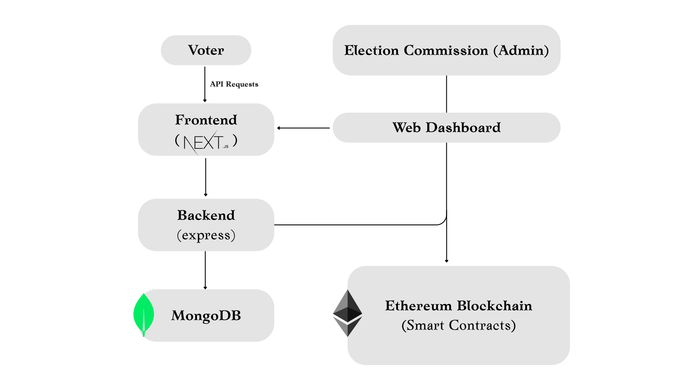

# Secure Decentralized Voting dApp with Biometric Authentication

[](LICENSE)  
[](https://hardhat.org)

---

## Table of Contents

1. [Introduction](#introduction)  
2. [The Problem](#the-problem)  
3. [Our Solution](#our-solution)  
4. [Key Features](#key-features)  
5. [Tech Stack](#tech-stack)  
6. [Architecture](#architecture)  
7. [Prerequisites](#prerequisites)  
8. [Installation & Setup](#installation--setup)  
9. [Usage](#usage)  
10. [Smart Contract Deployment](#smart-contract-deployment)  
11. [Biometric Authentication](#biometric-authentication) 
12. [License](#license)  
13. [Author](#author)

---

## Introduction

The **Secure Decentralized Voting dApp** leverages Ethereum smart contracts, The Graph, ethers.js and a biometric authentication layer to deliver a transparent, tamper-proof election platform. Voters can register and cast ballots from anywhere, while real-time vote counting and immutable audit trails rebuild trust in democratic processes.

---

## The Problem

- **Security Risks**: Traditional voting systems can be tampered with and lack a robust integrity framework.  
- **Transparency Gaps**: Manual counting and reconciliation introduce doubts about accuracy.  
- **Accessibility Barriers**: Physical polling locations can exclude remote or differently-abled voters.  
- **Delayed Results**: Manual tabulation can take days, fueling uncertainty.

---

## Our Solution

- **Blockchain Security**: A Solidity smart contract automatically records and counts votes, eliminating human error.  
- **Immutable Audit Trail**: Every vote appears on the blockchain, providing full transparency.  
- **Global Accessibility**: Any user with an Ethereum wallet (e.g., MetaMask) and an internet connection can participate.  
- **Instant Results**: Vote tallies are calculated on-chain, allowing results to be published the moment polls close.  
- **Biometric Verification**: Fingerprint or face-scan ensures only registered users can vote once.

---

## Key Features

- Candidate & Voter Registration  
- Secure On-chain Voting  
- Automated Vote Counting & Declaration  
- Real-time Dashboard (Admin/Auditor)  
- Role-Based Access Control  
- Biometric Authentication Layer  
- Efficient Data Querying via The Graph  
- Ethers.js Integration for blockchain interactions  
- Exportable Results (CSV/PDF)

---

## Tech Stack

- **Frontend**: React.js, Next.js, Tailwind CSS  
- **Backend/API**: Node.js, Express.js  
- **Blockchain**: Solidity, Hardhat, Ethers.js  
- **Indexing**: The Graph  
- **Database**: MongoDB (Mongoose)  
- **Biometric SDK**: (e.g., Neurotechnology or AWS Rekognition)  
- **Authentication**: JWT  
- **Testing**: Jest, Supertest, Mocha, Chai, Croco

---

## Architecture




---

## Prerequisites

- Node.js v14+ & npm  
- MongoDB (local or Atlas)  
- Hardhat (`npm install -g hardhat`)  
- Ethereum wallet (e.g., MetaMask)  
- Access to your chosen Biometric SDK

---

## Installation & Setup

```bash
# 1. Clone repo
git clone https://github.com/shailum17/BlockChain-Based-Voting-System-with-Biometric-Auth.git
cd BlockChain-Based-Voting-System-with-Biometric-Auth

# 2. Install frontend deps
cd client && npm install

# 3. Configure .env files
#    - backend/.env (MONGO_URI, JWT_SECRET, BIOMETRIC_API_KEY)
#    - blockchain/.env (PRIVATE_KEY, INFURA_API_KEY)

# 4. Start services
#    - frontend: `npx craco startt`

# 5. Connect MetaMask to http://localhost:3000
```

---

## Usage

1. **Admin**: Create elections, register voters, monitor results.  
2. **Voter**: Authenticate with biometrics → Cast vote → View confirmation.  
3. **Auditor**: Inspect the on-chain vote ledger and export results.


---

## Biometric Authentication

- Implement your SDK in `client/public/models`.  
- Store only encrypted template hashes in MongoDB.  
- Match templates server-side before allowing a vote.

---


## License

MIT © Shailendra Mourya

---

## Author

**Shailendra Mourya**  
- GitHub: [shailum17](https://github.com/shailum17)  
- Email: shailendramourya17@gmail.com
